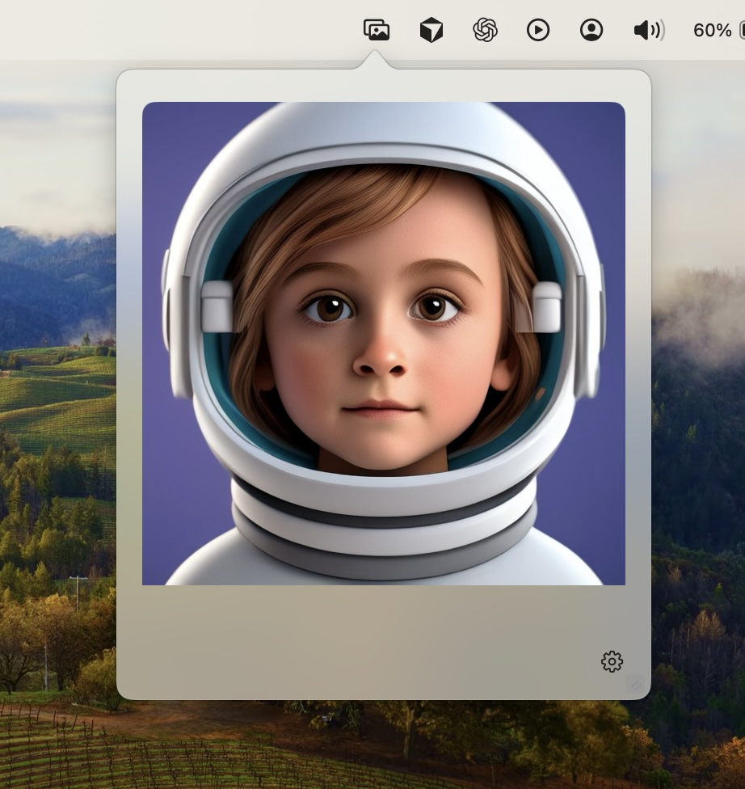

# Pictu

A lightweight macOS menubar utility for viewing and managing images. Pictu provides a convenient way to keep images accessible from your menubar with drag-and-drop support and persistent storage.

<div align="center">
  
</div>

## Features

### 🖼️ Image Management
- **Drag & Drop**: Drop images directly into the popover or preferences window
- **Persistent Storage**: Images are saved locally and persist between app launches
- **Thumbnail Gallery**: Browse all your images in a horizontal thumbnail strip
- **Active Image Display**: One image is always active and displayed in the main view
- **Image Deletion**: Remove images with the delete key or through the interface

### 🎛️ Menubar Integration
- **System Tray Icon**: Clean photo icon in the macOS menubar
- **Popover Interface**: Click the menubar icon to show/hide the image viewer
- **Resizable Window**: Drag the resize handle to adjust the popover size
- **Pinned Mode**: Keep the popover open permanently (won't auto-close)

### ⚙️ Preferences & Settings
- **General Settings**: Configure pinned state and appearance
- **Image Management**: Full image library with thumbnail browsing
- **Window Persistence**: Settings window remembers position and size
- **Accessibility**: Global keyboard shortcuts (requires accessibility permissions)

## Technical Details

### Architecture
- **SwiftUI**: Modern declarative UI framework
- **Core Data**: Persistent storage for app settings and image metadata
- **NSStatusItem**: Native macOS menubar integration
- **NSPopover**: Native popover interface
- **Combine**: Reactive state management

### Data Model
- **AppSettings**: Stores pinned state, window frame, and popover size
- **Image**: Stores image metadata (filename, creation date, active status)
- **File Storage**: Images stored in `~/Library/Application Support/Pictu/`

### Key Components
- `PictuApp.swift` - Main app entry point with settings integration
- `AppDelegate.swift` - Menubar management, keyboard shortcuts, window handling
- `ContentView.swift` - Main popover interface with drag-and-drop
- `PreferencesView.swift` - Settings window with image management
- `AppState.swift` - Centralized state management
- `PersistenceManager.swift` - Core Data and file system operations

## Requirements

- macOS 12.0 or later
- Xcode 14.0 or later (for building)
- Accessibility permissions (for global keyboard shortcuts)

## Installation

### Building from Source
1. Clone the repository
2. Open `Pictu.xcodeproj` in Xcode
3. Build and run the project
4. Grant accessibility permissions when prompted for keyboard shortcuts

### First Launch
1. The app will appear in your menubar with a photo icon
2. Click the icon to open the popover
3. Drop an image to get started
4. Right-click the menubar icon for additional options

## Usage

### Basic Operations
- **View Image**: Click menubar icon to show the current active image
- **Add Image**: Drag and drop an image into the popover or preferences window
- **Switch Images**: Use the thumbnail strip in preferences to select different images
- **Delete Image**: Select an image and press the delete key
- **Resize**: Drag the resize handle in the bottom-right corner of the popover

### Settings
- **Open Settings**: Right-click menubar icon → Settings, or use `⌘,`
- **General Tab**: Configure pinned state and view app information
- **Images Tab**: Manage your image library with thumbnail browsing

## Development

### Project Structure
```
Pictu/
├── PictuApp.swift          # App entry point
├── AppDelegate.swift       # Menubar and window management
├── ContentView.swift       # Main popover interface
├── PreferencesView.swift   # Settings window
├── AppState.swift          # State management
├── PersistenceManager.swift # Data persistence
└── Pictu.xcdatamodeld/     # Core Data model
```

### Key Features Implementation
- **Drag & Drop**: Uses `onDrop` modifier with `NSItemProvider`
- **Menubar Integration**: `NSStatusItem` with custom button and popover
- **State Management**: `@Published` properties with Combine
- **Persistence**: Core Data for metadata, file system for images
- **Keyboard Shortcuts**: Global event monitoring with accessibility permissions

## Contributing

This is a personal project, but suggestions and improvements are welcome. The codebase follows SwiftUI best practices and uses modern macOS APIs.

## License

This project is for personal use. Please respect the code and don't redistribute without permission.
